# AWS Auto Scaling & Cost Optimization using Power BI

A hands-on AWS cloud project demonstrating EC2 deployment, Application Load Balancing, Auto Scaling, CloudWatch monitoring, load testing, AWS cost analysis, and Power BI dashboard visualization.

---

## Project Overview

This project demonstrates the implementation and analysis of an AWS-based application environment.

The project combines AWS infrastructure implementation with monitoring, workload testing, cost analysis, and Power BI visualization.

The main focus of the project is to understand how cloud infrastructure responds to workload changes and how monitoring and cost-related information can be analyzed using Power BI.

---

## Project Objectives

- Deploy and configure applications on Amazon EC2.
- Configure an Application Load Balancer.
- Implement EC2 Auto Scaling.
- Configure Scale-Out and Scale-In policies.
- Monitor EC2 CPU utilization using Amazon CloudWatch.
- Generate application workload using Apache Benchmark.
- Observe infrastructure behavior during workload.
- Analyze AWS infrastructure and cost-related data.
- Prepare datasets using Microsoft Excel.
- Create Power BI dashboards for infrastructure analysis.
- Document the complete AWS implementation and analysis.

---

# Project Architecture

The project follows an AWS infrastructure workflow where application traffic is distributed through an Application Load Balancer and handled by EC2 instances managed through an Auto Scaling Group.

Amazon CloudWatch is used to monitor the infrastructure, while Apache Benchmark is used to generate workload and observe infrastructure behavior under increased traffic.

The resulting monitoring and cost-related information is prepared as datasets and analyzed using Microsoft Power BI.

## System Architecture

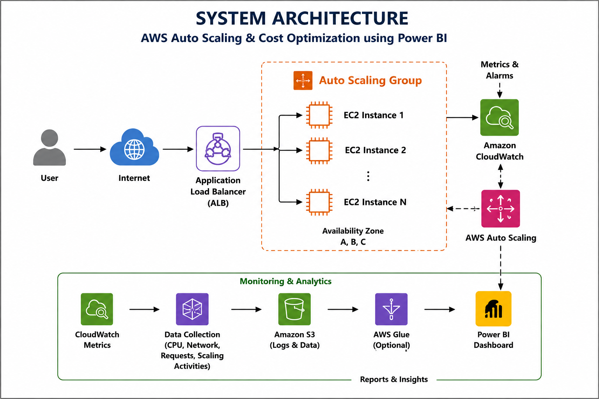

## Data Flow Diagram

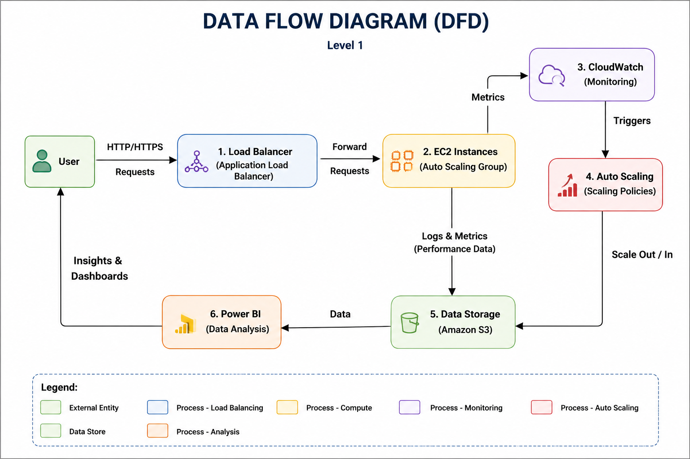

## Deployment Diagram

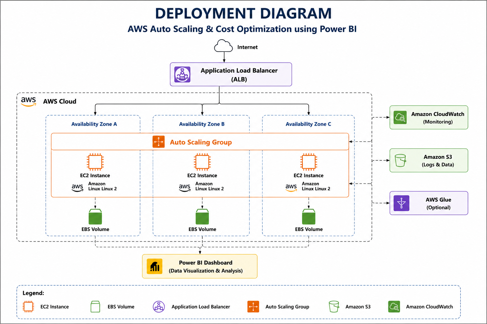

## Activity Diagram

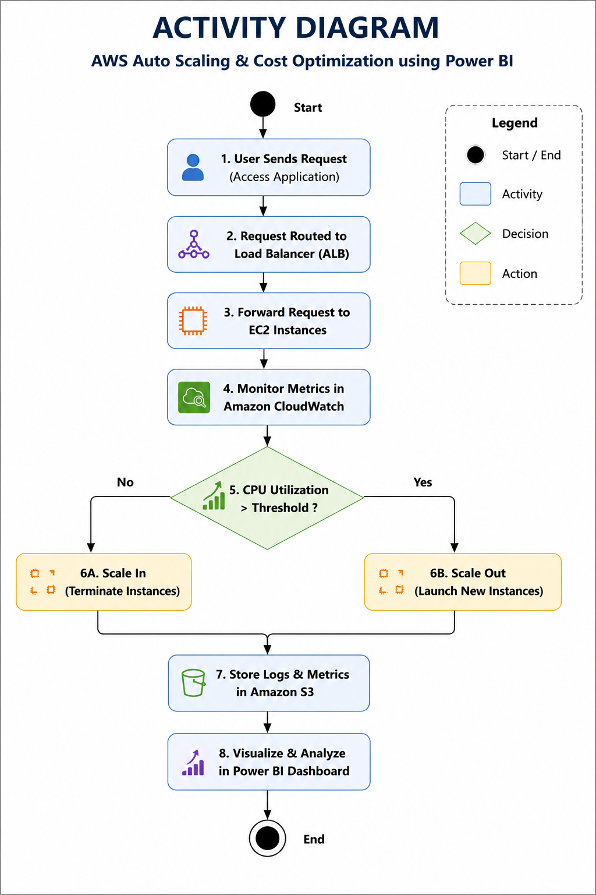

---

# AWS Infrastructure

The AWS environment implemented in this project consists of the following major components:

- Amazon EC2
- Application Load Balancer
- EC2 Auto Scaling
- Amazon CloudWatch
- AWS Billing
- Apache Benchmark

---

# Amazon EC2

Amazon EC2 was used to create and configure the application instances.

The implementation includes:

- EC2 instance creation
- Instance launch
- Security group configuration
- Application deployment
- Package installation
- SSH connectivity
- Multiple EC2 instances
- Verification of the running application

Detailed EC2 implementation screenshots are available in:

`aws/ec2/`

## EC2 Implementation Screenshots

### EC2 Launch Page

### EC2 Instance Launched

### Application Running

### Multiple EC2 Instances

### Packages Installed

### Security Groups

### SSH Login

---

# Application Load Balancer

An Application Load Balancer was configured to distribute incoming application traffic across the EC2 instances.

The implementation includes:

- Application Load Balancer creation
- Target Group configuration
- EC2 target registration
- Load Balancer configuration
- Load Balancer testing
- Verification of application availability

Detailed implementation screenshots are available in:

`aws/load-balancer/`

## Load Balancer Implementation

### Application Load Balancer Configuration

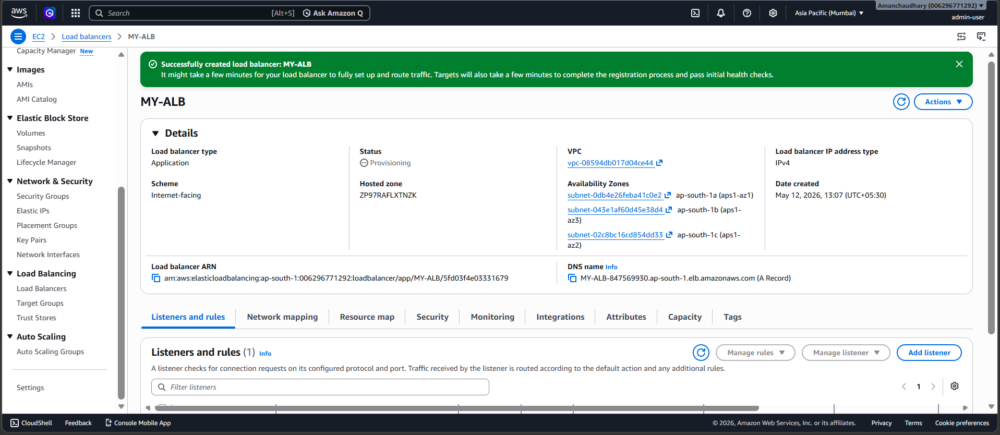

### Target Group

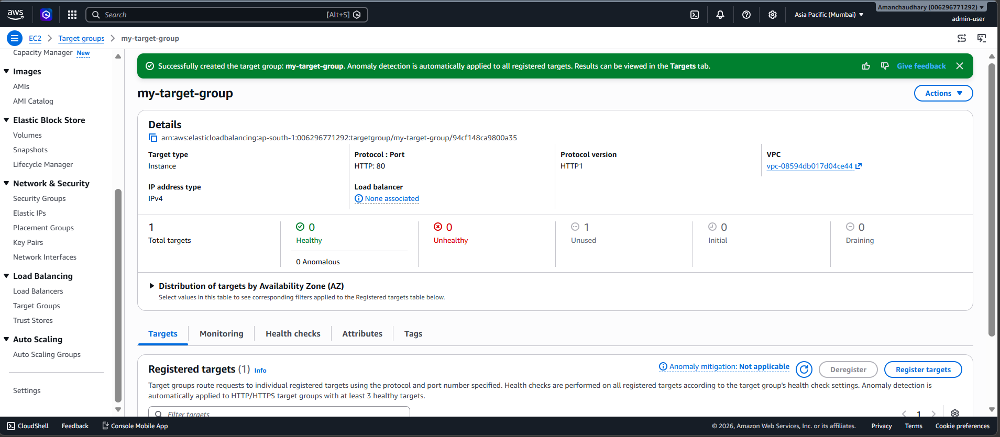

### Application Load Balancer Working

---

# EC2 Auto Scaling

EC2 Auto Scaling was configured to automatically adjust compute capacity based on workload conditions.

The implementation includes:

- Launch Template
- Auto Scaling Group
- Scaling Policy
- Scale-Out configuration
- Scale-In configuration
- Verification of scaling activity

Detailed Auto Scaling screenshots are available in:

`aws/auto-scaling/`

## Auto Scaling Implementation

### Launch Template

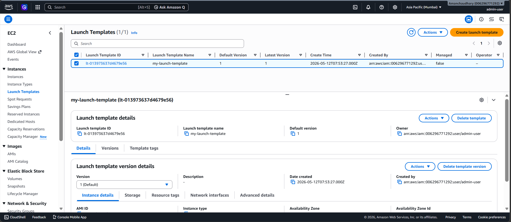

### Auto Scaling Group Created

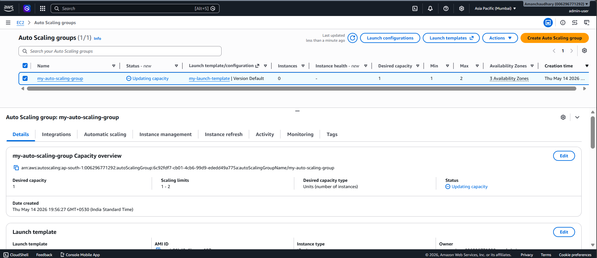

### Scaling Policy

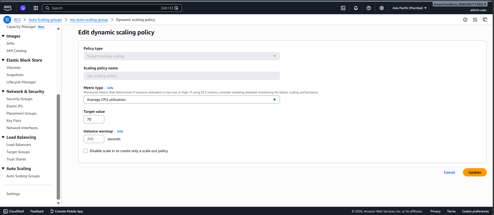

### Scale-Out

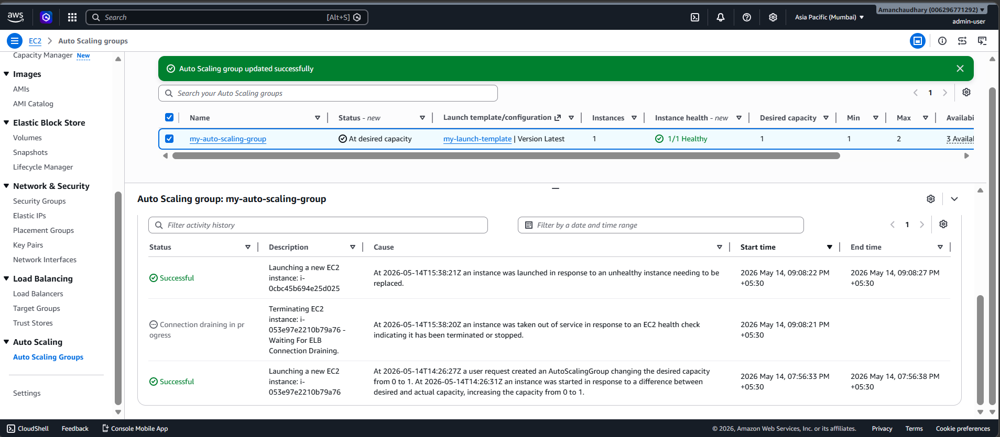

### Scale-In

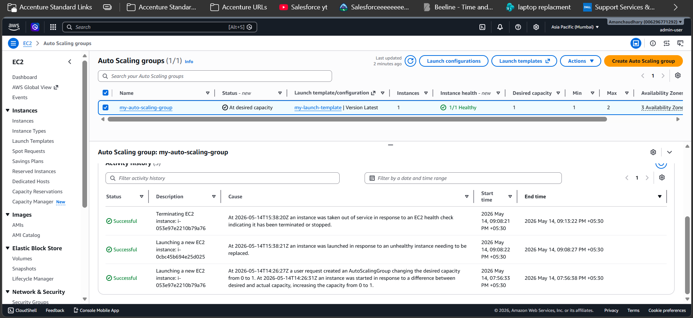

---

# Amazon CloudWatch

Amazon CloudWatch was used to monitor EC2 CPU utilization and observe infrastructure behavior.

CPU utilization was observed before and after workload was applied using Apache Benchmark.

The monitoring data helps demonstrate the effect of workload on the EC2 environment and supports the validation of the Auto Scaling configuration.

Detailed CloudWatch documentation and screenshots are available in:

`aws/cloudwatch/`

## CloudWatch Monitoring

### CPU Utilization Before Load

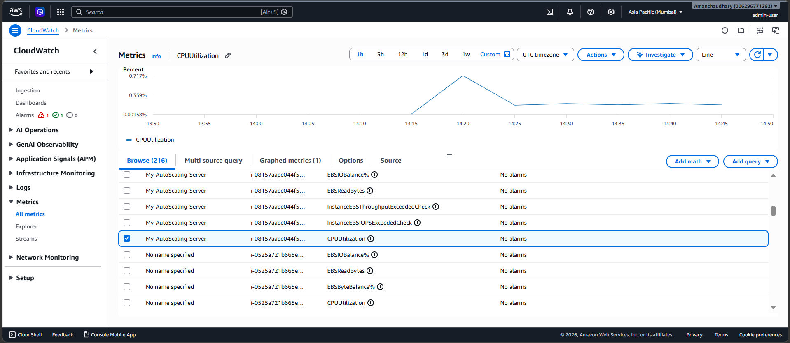

### CPU Utilization After Load

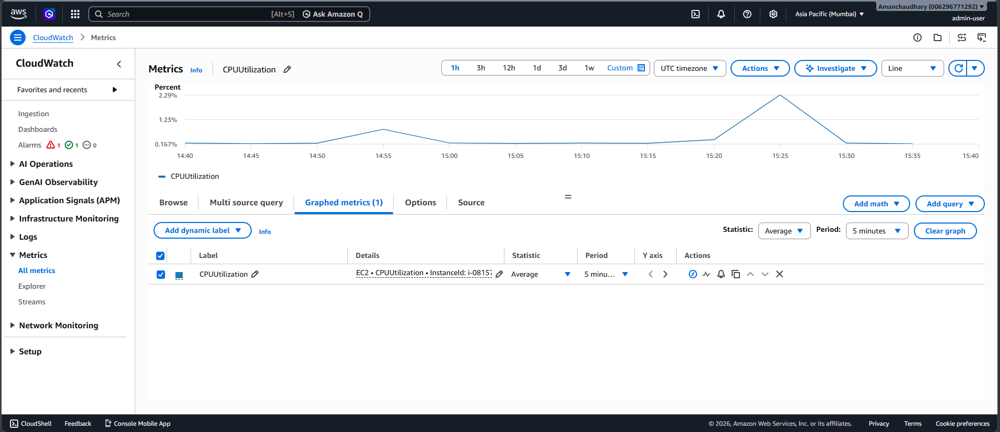

## Monitoring Summary

The CloudWatch monitoring results provide visibility into EC2 CPU utilization and help demonstrate the effect of workload on the cloud infrastructure.

The monitoring data can be used alongside the Auto Scaling configuration to understand how changes in workload relate to changes in compute capacity.

---

# Load Testing

Apache Benchmark (AB) was used to generate HTTP workload against the deployed application.

The generated workload was used to observe application and infrastructure behavior and support the validation of the Auto Scaling configuration.

Detailed load testing documentation is available in:

`aws/load-testing/`

## Objectives

- Generate workload against the deployed application.
- Test the application under increased traffic.
- Observe the response of the AWS infrastructure to workload.
- Support validation of the Auto Scaling configuration.
- Generate workload that can be observed through Amazon CloudWatch monitoring.

## Apache Benchmark

Apache Benchmark (`ab`) was used to generate HTTP requests against the application.

## Load Testing Process

The load testing process involved generating requests against the deployed application using Apache Benchmark.

The generated workload increased the activity on the application infrastructure, which could then be observed through Amazon CloudWatch monitoring.

## Monitoring and Scaling

The workload generated during load testing was used along with:

- Amazon EC2
- Application Load Balancer
- EC2 Auto Scaling
- Amazon CloudWatch

This helped observe how the infrastructure responds to changes in workload and supports the overall Auto Scaling analysis.

---

# AWS Billing & Cost Analysis

AWS Billing information was included as part of the cost optimization analysis.

The billing information was used to understand AWS cost-related data and support the overall project objective of analyzing infrastructure usage and cost.

Detailed billing documentation is available in:

`aws/billing/`

## Cost Dashboard

The cost-related information was analyzed and visualized using Microsoft Power BI.

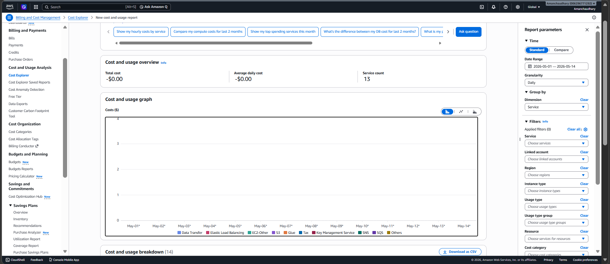

---

# Power BI Analysis & Dashboard

Microsoft Power BI was used to analyze AWS infrastructure and cost-related information.

Power BI was used to create interactive dashboards for understanding:

- Auto Scaling behavior
- AWS cost information
- EC2 infrastructure and performance
- Load Balancer activity

The Power BI documentation, datasets, dashboard screenshots, and project files are available in:

`powerbi/`

---

# Power BI Dashboard

The project dashboard combines AWS infrastructure and monitoring data to provide a consolidated view of the project.

---

# Power BI Dashboard Analysis

## 1. Auto Scaling Dashboard

The Auto Scaling dashboard provides visual analysis related to scaling activity and infrastructure capacity.

---

## 2. Cost Dashboard

The Cost Dashboard provides visualization of AWS cost-related information used for the project's cost analysis and optimization.

---

## 3. EC2 Dashboard

The EC2 dashboard provides visualization of EC2-related infrastructure and performance information.

---

## 4. Load Balancer Dashboard

The Load Balancer dashboard provides visualization of load balancer-related information and traffic analysis.

---

# Power BI Dataset

The Power BI dashboards were created using project-related AWS datasets.

Microsoft Excel was used for dataset preparation and analysis before visualization in Power BI.

The Power BI folder contains:

- AWS analysis dataset
- Power BI project file
- Dashboard screenshots
- Dataset loading screenshots
- EC2 analysis screenshots
- Load Balancer analysis screenshots

## Dataset

`powerbi/aws_analysis_dataset.xlsx`

## Dataset Loaded into Power BI

## EC2 CPU Analysis Dataset

## Load Balancer Analysis Dataset

---

# AWS to Power BI Workflow

The overall project workflow connects AWS infrastructure, workload testing, monitoring, cost data, dataset preparation, and visualization.

    AWS Infrastructure
            |
            v
    EC2 / Auto Scaling / Load Balancer
            |
            v
    Load Testing
            |
            v
    CloudWatch Monitoring
            |
            v
    Monitoring & Cost Data
            |
            v
    Excel Dataset
            |
            v
    Microsoft Power BI
            |
            v
    Interactive Dashboards

---

# End-to-End Project Workflow

    AWS CLOUD
        |
        v
    +------------------+
    |    Amazon EC2    |
    +------------------+
        |
        v
    +------------------+
    | Application Load |
    |     Balancer     |
    +------------------+
        |
        v
    +-------------------+
    |  EC2 Auto Scaling |
    +-------------------+
        /          \
       /            \
      v              v
    +-------------+  +-------------+
    | EC2 Instance|  | EC2 Instance|
    |      1      |  |      2      |
    +-------------+  +-------------+
       \            /
        \          /
         v        v
    +------------------+
    | Apache Benchmark |
    |   Load Testing   |
    +------------------+
        |
        v
    +------------------+
    | Amazon CloudWatch|
    +------------------+
        |
        v
    +------------------+
    | Monitoring Data  |
    |  & Cost Data     |
    +------------------+
        |
        v
    +------------------+
    |  Excel Dataset   |
    +------------------+
        |
        v
    +------------------+
    |  Microsoft Power |
    |       BI         |
    +------------------+
        |
        v
    +------------------+
    |    Dashboards    |
    +------------------+

---

# Repository Structure

    aws-autoscaling-cost-optimization-powerbi/
    │
    ├── README.md
    │
    ├── architecture/
    │   ├── README.md
    │   ├── system-architecture.png
    │   ├── data-flow-diagram.png
    │   ├── deployment-diagram.png
    │   └── activity-diagram.png
    │
    ├── aws/
    │   │
    │   ├── auto-scaling/
    │   │   ├── README.md
    │   │   ├── asg-created.png
    │   │   ├── launch-template.png
    │   │   ├── scale-in.png
    │   │   ├── scale-out.png
    │   │   └── scaling-policy.png
    │   │
    │   ├── cloudwatch/
    │   │   ├── README.md
    │   │   ├── cpu-before-load.png
    │   │   └── cpu-after-load.png
    │   │
    │   ├── ec2/
    │   │   ├── README.md
    │   │   ├── ec2-application-running.png
    │   │   ├── ec2-instance-launched.png
    │   │   ├── ec2-launch-page.png
    │   │   ├── ec2-multiple-instances.png
    │   │   ├── ec2-packages-installed.png
    │   │   ├── ec2-security-groups.png
    │   │   └── ec2-ssh-login.png
    │   │
    │   ├── load-balancer/
    │   │   ├── README.md
    │   │   ├── ALB-working.png
    │   │   ├── ALB-created-configuration.png
    │   │   └── target-group.png
    │   │
    │   └── load-testing/
    │       ├── README.md
    │       └── ab-load-test.png
    │
    ├── billing/
    │   ├── README.md
    │   └── cost-dashboard.png
    │
    └── powerbi/
        ├── README.md
        ├── aws_analysis_dataset.xlsx
        ├── powerbi-home.png
        ├── dashboard-autoscaling.png
        ├── dashboard-cost.png
        ├── dashboard-ec2.png
        ├── dashboard-loadbalancer.png
        ├── data-loaded.png
        ├── ec2-cpu-analysis-excel-dataset.png
        └── loadbalancer-analysis-excel-dataset.png

---

# Technologies Used

## AWS Services

- Amazon EC2
- EC2 Auto Scaling
- Application Load Balancer
- Amazon CloudWatch
- AWS Billing
- AWS Management Console

## Data & Analytics

- Microsoft Power BI
- Microsoft Excel

## Testing

- Apache Benchmark (AB)

## Documentation & Version Control

- GitHub
- Markdown

---

# Key Learning Outcomes

This project provided practical hands-on experience in:

- Amazon EC2 deployment and management.
- Application Load Balancer configuration.
- Target Group configuration.
- EC2 Auto Scaling configuration.
- Launch Template creation.
- Auto Scaling Group configuration.
- Scale-Out and Scale-In policies.
- CloudWatch CPU monitoring.
- Application workload generation.
- Load testing using Apache Benchmark.
- AWS infrastructure analysis.
- AWS cost analysis.
- Excel-based data preparation.
- Power BI dashboard development.
- Cloud architecture documentation.
- GitHub project documentation.

---

# Project Highlights

- Implemented an AWS-based application environment.
- Configured multiple EC2 instances.
- Configured an Application Load Balancer.
- Configured a Target Group.
- Implemented EC2 Auto Scaling.
- Created a Launch Template.
- Configured Scale-Out and Scale-In policies.
- Tested scaling behavior.
- Monitored CPU utilization using CloudWatch.
- Generated application workload using Apache Benchmark.
- Observed infrastructure behavior under workload.
- Analyzed AWS infrastructure information.
- Analyzed AWS cost-related information.
- Prepared datasets using Microsoft Excel.
- Created interactive Power BI dashboards.
- Documented the complete implementation in GitHub.

---

# Documentation

Detailed documentation is organized into separate sections:

- **Architecture** — System architecture, data flow, deployment, and activity diagrams.
- **EC2** — EC2 instance deployment and configuration.
- **Load Balancer** — Application Load Balancer and Target Group configuration.
- **Auto Scaling** — Launch Template, Auto Scaling Group, and scaling policies.
- **CloudWatch** — CPU utilization monitoring before and after load testing.
- **Load Testing** — Apache Benchmark workload testing.
- **Billing** — AWS cost-related information and cost analysis.
- **Power BI** — Dataset preparation, analysis, and interactive dashboards.

---

# Project Flow Summary

    EC2 Deployment
          |
          v
    Application Deployment
          |
          v
    Application Load Balancer
          |
          v
    EC2 Auto Scaling
          |
          v
    Load Testing
          |
          v
    CloudWatch Monitoring
          |
          v
    AWS Cost Analysis
          |
          v
    Excel Dataset Preparation
          |
          v
    Power BI Analysis
          |
          v
    Interactive Dashboards

---

# Conclusion

This project demonstrates an end-to-end AWS cloud workflow combining infrastructure deployment, application hosting, load balancing, automatic scaling, monitoring, load testing, cost analysis, and Power BI visualization.

The project provides practical hands-on experience with AWS cloud infrastructure and demonstrates how workload, monitoring, and cost-related information can be analyzed to understand infrastructure behavior and support cloud optimization.

---

# Author

**Aman Chaudhary**

AWS Cloud Learning & Hands-on Project Portfolio
