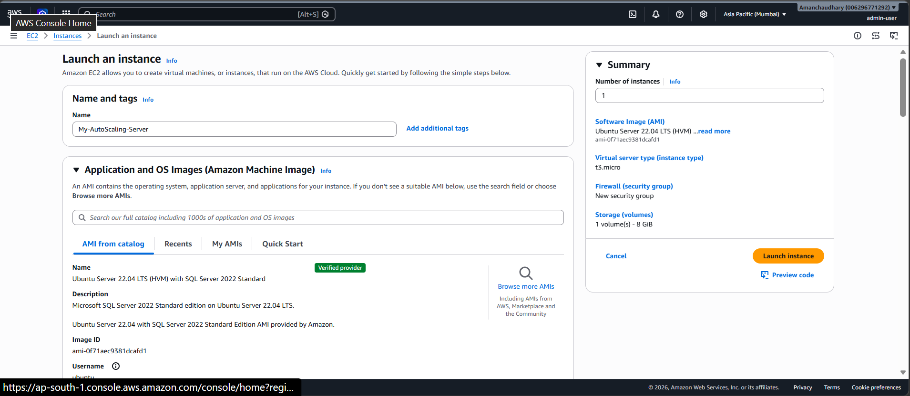
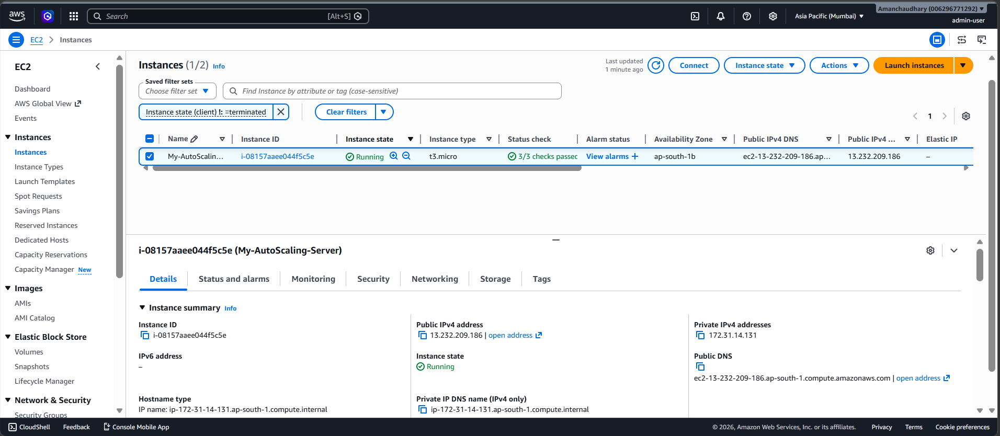
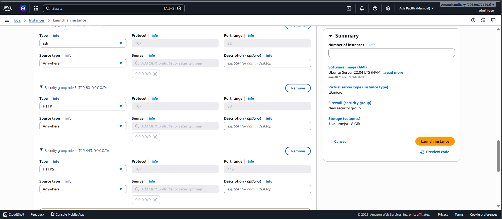
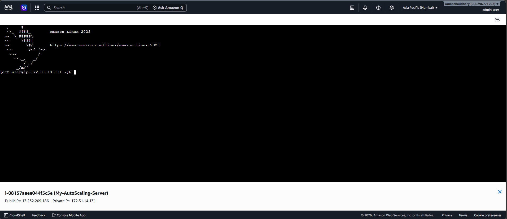
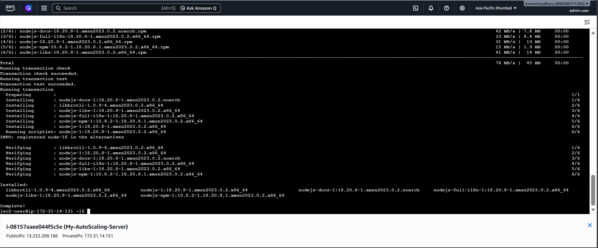
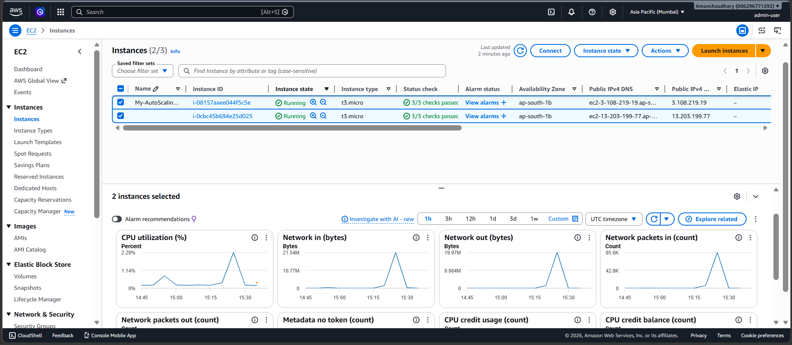

# Amazon EC2

This section documents the Amazon EC2 implementation completed as part of the **AWS Auto Scaling & Cost Optimization using Power BI** project.

The EC2 environment was used to deploy and run the application, configure instances, establish secure access, install required packages, and support multiple running instances for the Auto Scaling and Load Balancing components.

---

## Objectives

- Launch and configure Amazon EC2 instances.
- Configure security groups for instance access.
- Connect to EC2 instances using SSH.
- Install the required packages and dependencies.
- Deploy and verify the application on the EC2 instance.
- Configure and test multiple EC2 instances as part of the scalable cloud infrastructure.

---

## EC2 Implementation

### 1. EC2 Launch Page

The EC2 instance was configured and launched using the AWS Management Console.

---

### 2. EC2 Instance Launched

The successfully launched EC2 instance was verified from the EC2 console.

---

### 3. Security Group Configuration

Security groups were configured to control inbound and outbound traffic to the EC2 instance.

---

### 4. SSH Login

SSH was used to securely connect to the EC2 instance for administration and application setup.

---

### 5. Packages Installed

Required packages and dependencies were installed on the EC2 instance to prepare the environment for running the application.

---

### 6. Application Running

The application was successfully deployed and verified as running on the EC2 instance.

---

### 7. Multiple EC2 Instances

Multiple EC2 instances were configured as part of the scalable infrastructure design. This supports the project's Auto Scaling and Load Balancing implementation.

---

## Implementation Summary

The EC2 component provides the compute layer for the project. The instances host the application workload and form the foundation for the project's Auto Scaling and Load Balancing architecture.

The implementation covered:

- EC2 instance provisioning
- Instance configuration
- Security group configuration
- SSH-based administration
- Package installation
- Application deployment
- Multiple-instance configuration

---

## Technologies Used

- Amazon EC2
- AWS Security Groups
- SSH
- Linux
- AWS Management Console
