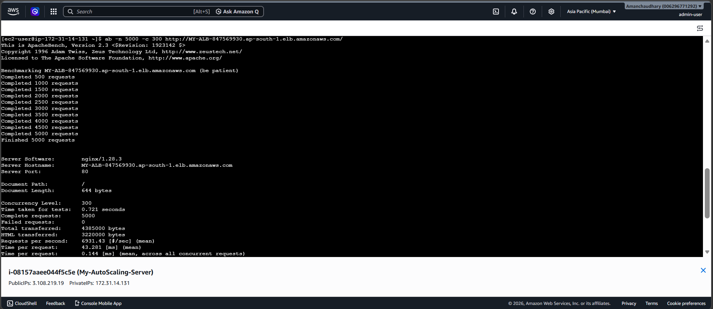

# Load Testing

This section documents the application load testing performed as part of the **AWS Auto Scaling & Cost Optimization using Power BI** project.

Apache Benchmark (`ab`) was used to generate HTTP requests against the application and create workload for evaluating the cloud infrastructure.

---

## Objective

- Generate application traffic using Apache Benchmark.
- Create workload against the deployed application.
- Observe the effect of increased workload on the AWS infrastructure.
- Support validation of the Auto Scaling and CloudWatch monitoring components.

---

## Load Testing Implementation

### Apache Benchmark

Apache Benchmark was used to send HTTP requests to the application endpoint.



---

## Testing Flow

The load testing process was used to generate workload against the application:

```text
Application
     ↓
Apache Benchmark
     ↓
HTTP Requests
     ↓
Application Load Balancer
     ↓
EC2 Instances
     ↓
CloudWatch Monitoring
