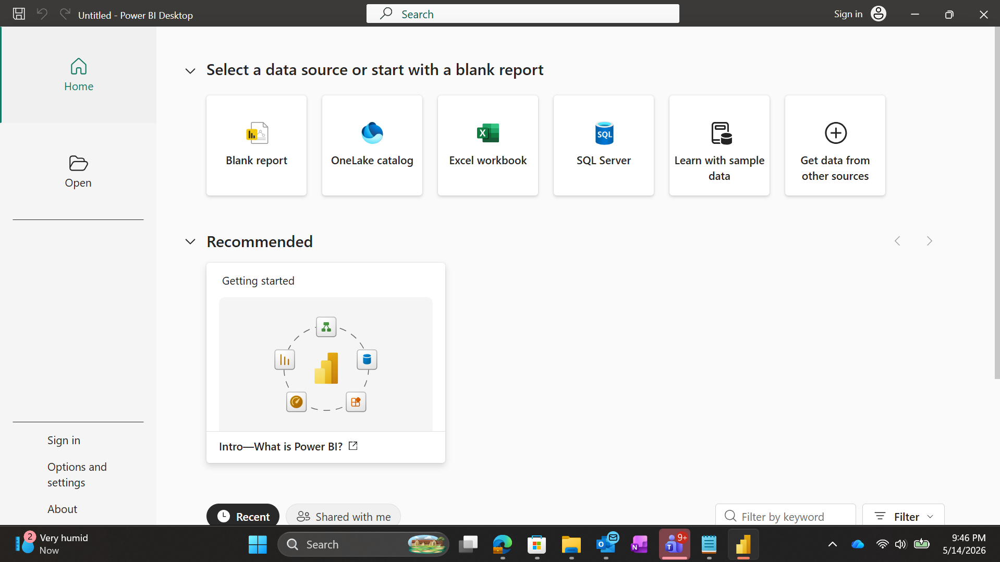
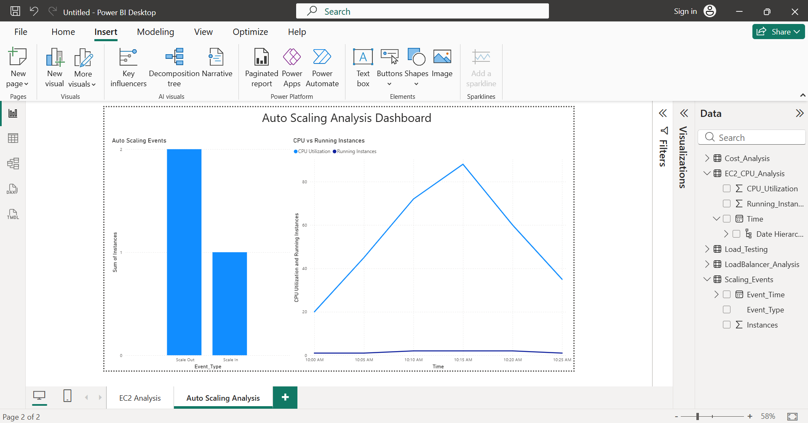
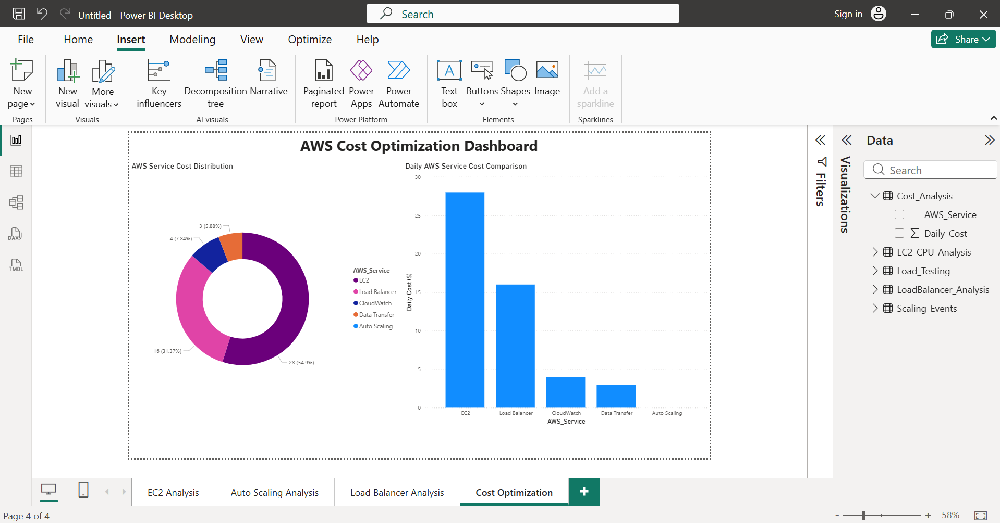
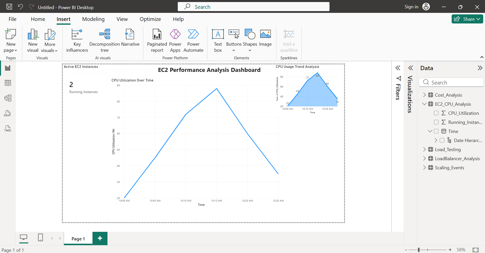
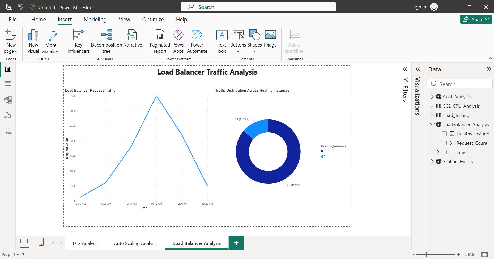

# Power BI Analysis & Dashboard

This section documents the Power BI analysis performed as part of the **AWS Auto Scaling & Cost Optimization using Power BI** project.

Power BI was used to analyze AWS infrastructure data and create dashboards for understanding Auto Scaling, EC2 performance, load balancer activity, and cost-related information.

---

## Objectives

- Analyze AWS infrastructure data using Power BI.
- Visualize EC2 performance and infrastructure activity.
- Analyze Auto Scaling behavior.
- Analyze load balancer information.
- Visualize AWS cost-related information.
- Create interactive dashboards for infrastructure analysis.

---

## Power BI Dashboard

The project dashboard combines AWS infrastructure and monitoring data to provide a consolidated view of the project.

---

## Dashboard Analysis

### 1. Auto Scaling Dashboard

The Auto Scaling dashboard provides visual analysis related to scaling activity and infrastructure capacity.

---

### 2. Cost Dashboard

The cost dashboard provides visualization of AWS cost-related information used for the project's cost optimization analysis.

---

### 3. EC2 Dashboard

The EC2 dashboard provides visualization of EC2-related infrastructure and performance information.

---

### 4. Load Balancer Dashboard

The Load Balancer dashboard provides visualization of load balancer-related information and traffic analysis.

---

## Dataset

The Power BI dashboards were created using project-related AWS datasets.

The datasets contain information used for analyzing infrastructure performance, Auto Scaling, load balancer activity, and cost-related information.

---

## Power BI Project File

The complete Power BI project file is included in this repository:

`AWS_AutoScaling_Cost_Optimization_Dashboard.pbix`

The file can be opened using Microsoft Power BI Desktop.

---

## AWS Integration

The Power BI analysis is part of the overall AWS project workflow:

**AWS Infrastructure**  
↓  
**EC2 / Auto Scaling / Load Balancer**  
↓  
**Monitoring & Cost Data**  
↓  
**Dataset**  
↓  
**Power BI**  
↓  
**Interactive Dashboards**

---

## Technologies Used

- Microsoft Power BI
- Microsoft Excel
- Amazon EC2
- EC2 Auto Scaling
- Application Load Balancer
- Amazon CloudWatch
- AWS Billing
- AWS Management Console
