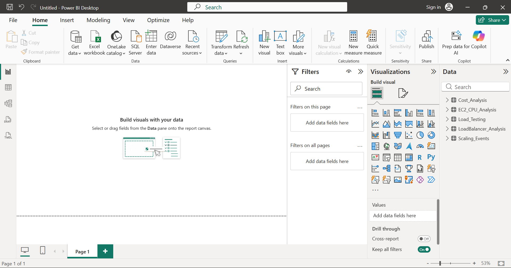
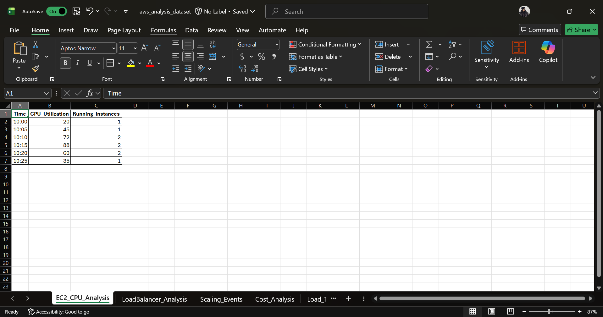
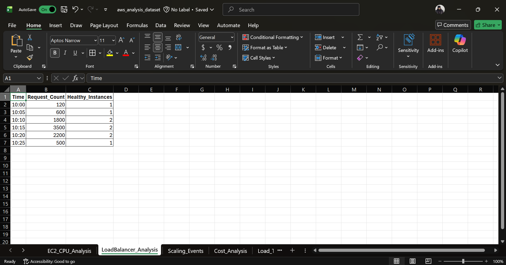

# Power BI Analysis & Dashboard

This section documents the Power BI analysis performed as part of the **AWS Auto Scaling & Cost Optimization using Power BI** project.

Microsoft Power BI was used to analyze AWS infrastructure and cost-related information and create interactive dashboards for understanding Auto Scaling, EC2 performance, Load Balancer activity, and AWS cost information.

---

## Objectives

- Analyze AWS infrastructure data using Microsoft Power BI.
- Visualize EC2 infrastructure and performance information.
- Analyze EC2 Auto Scaling behavior.
- Analyze Application Load Balancer activity.
- Analyze AWS cost-related information.
- Prepare and use datasets for visualization.
- Create interactive dashboards for infrastructure analysis.

---

## Power BI Dashboard

The project dashboard provides a consolidated view of the AWS infrastructure and analysis performed as part of the project.


---

## Dashboard Analysis

### 1. Auto Scaling Dashboard

The Auto Scaling dashboard provides visual analysis of scaling activity and infrastructure capacity.


---

### 2. Cost Dashboard

The Cost Dashboard provides visualization of AWS cost-related information used for the project's cost analysis and optimization.


---

### 3. EC2 Dashboard

The EC2 dashboard provides visualization of EC2-related infrastructure and performance information.


---

### 4. Load Balancer Dashboard

The Load Balancer dashboard provides visualization of Application Load Balancer activity and related traffic information.


---

## Power BI Dataset

The Power BI dashboards were created using project-related AWS datasets.

Microsoft Excel was used for dataset preparation and analysis before the data was visualized in Power BI.

### Dataset

The main dataset used for the Power BI analysis is:

`aws_analysis_dataset.xlsx`

---

## Dataset Loaded into Power BI

The prepared dataset was loaded into Microsoft Power BI for analysis and dashboard development.



---

## EC2 CPU Analysis

The EC2 CPU-related dataset was analyzed to support infrastructure performance analysis and visualization.



---

## Load Balancer Analysis

The Load Balancer dataset was analyzed to support visualization of Application Load Balancer activity and traffic-related information.



---

## Power BI Project File

The complete Power BI dashboard project file is included in this folder:

`aws-autoscaling-cost-optimization-dashboard.pbix`

The file can be opened using **Microsoft Power BI Desktop**.

---

## AWS to Power BI Workflow

The Power BI analysis is part of the overall AWS project workflow:

```text
AWS Infrastructure
        |
        v
EC2 / Auto Scaling / Load Balancer
        |
        v
Monitoring & Cost Data
        |
        v
Excel Dataset
        |
        v
Microsoft Power BI
        |
        v
Interactive Dashboards
```

---

## Dashboard Coverage

The Power BI dashboards provide analysis across the following areas:

| Dashboard | Analysis |
|---|---|
| Auto Scaling | Scaling activity and infrastructure capacity |
| Cost | AWS cost-related information |
| EC2 | EC2 infrastructure and performance |
| Load Balancer | Load Balancer activity and traffic |

---

## Technologies Used

### AWS Services

- Amazon EC2
- EC2 Auto Scaling
- Application Load Balancer
- Amazon CloudWatch
- AWS Billing
- AWS Management Console

### Data & Analytics

- Microsoft Power BI
- Microsoft Excel

### Testing

- Apache Benchmark (AB)

### Documentation & Version Control

- GitHub
- Markdown

---

## Key Learning Outcomes

This Power BI project provided practical experience in:

- Preparing AWS-related datasets using Microsoft Excel.
- Loading datasets into Microsoft Power BI.
- Analyzing EC2 infrastructure and CPU-related information.
- Analyzing Auto Scaling activity.
- Analyzing Application Load Balancer information.
- Analyzing AWS cost-related information.
- Creating Power BI dashboards.
- Creating visualizations for cloud infrastructure analysis.
- Connecting infrastructure monitoring and cost information with data visualization.
- Documenting cloud analytics work using GitHub.

---

## Project Highlights

- Created a consolidated Power BI dashboard.
- Created an Auto Scaling analysis dashboard.
- Created an AWS Cost analysis dashboard.
- Created an EC2 analysis dashboard.
- Created a Load Balancer analysis dashboard.
- Prepared AWS-related datasets using Microsoft Excel.
- Loaded datasets into Power BI.
- Analyzed infrastructure performance information.
- Analyzed cost-related information.
- Documented the analysis and dashboards in GitHub.

---

## Folder Contents

```text
powerbi/
│
├── README.md
├── aws-autoscaling-cost-optimization-dashboard.pbix
├── aws_analysis_dataset.xlsx
│
├── powerbi-home.png
├── dashboard-autoscaling.png
├── dashboard-cost.png
├── dashboard-ec2.png
├── dashboard-loadbalancer.png
│
├── data-loaded.png
├── ec2-cpu-analysis-excel-dataset.png
└── loadbalancer-analysis-excel-dataset.png
```

---

## Project Integration

The Power BI component connects the AWS infrastructure and analytical data collected throughout the project.

```text
AWS Infrastructure
        |
        v
EC2 Deployment
        |
        v
Application Load Balancer
        |
        v
EC2 Auto Scaling
        |
        v
Load Testing
        |
        v
CloudWatch Monitoring
        |
        v
AWS Cost Analysis
        |
        v
Excel Dataset Preparation
        |
        v
Microsoft Power BI
        |
        v
Interactive Dashboards
```

---

## Conclusion

The Power BI component of this project demonstrates how AWS infrastructure, monitoring, workload, and cost-related information can be prepared, analyzed, and presented through interactive dashboards.

The dashboards provide a consolidated analytical view of Auto Scaling, EC2 performance, Load Balancer activity, and AWS cost information.

This completes the Power BI analysis and visualization component of the **AWS Auto Scaling & Cost Optimization using Power BI** project.

---

## Author

**Aman Chaudhary**

AWS Cloud Learning & Hands-on Project Portfolio
